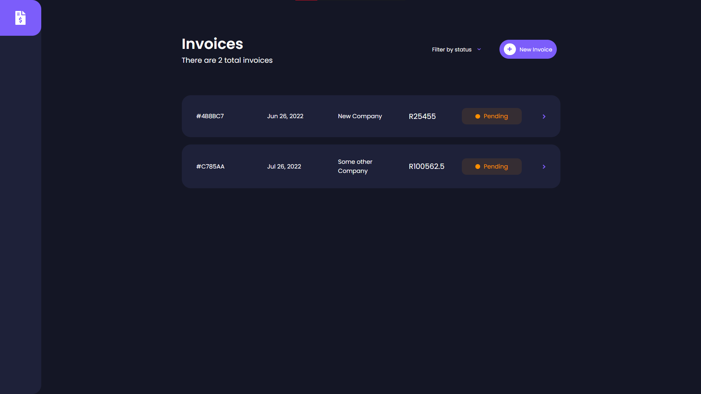
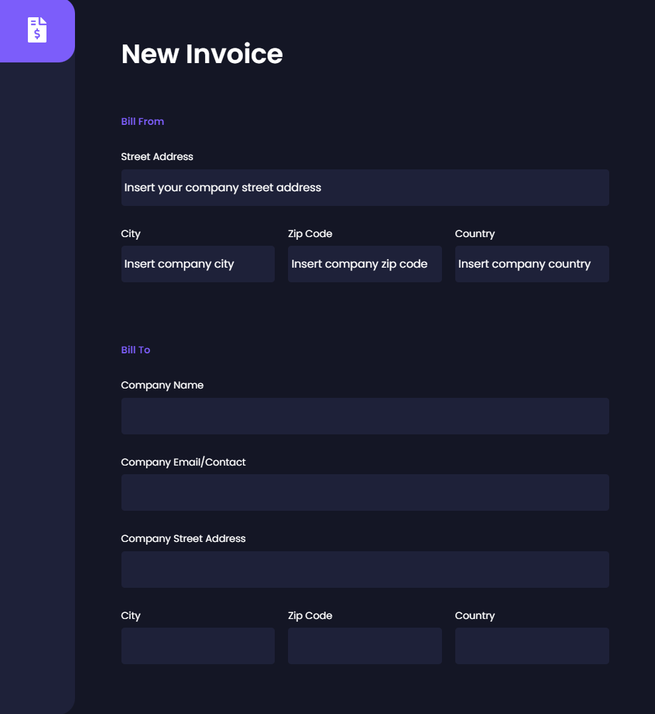
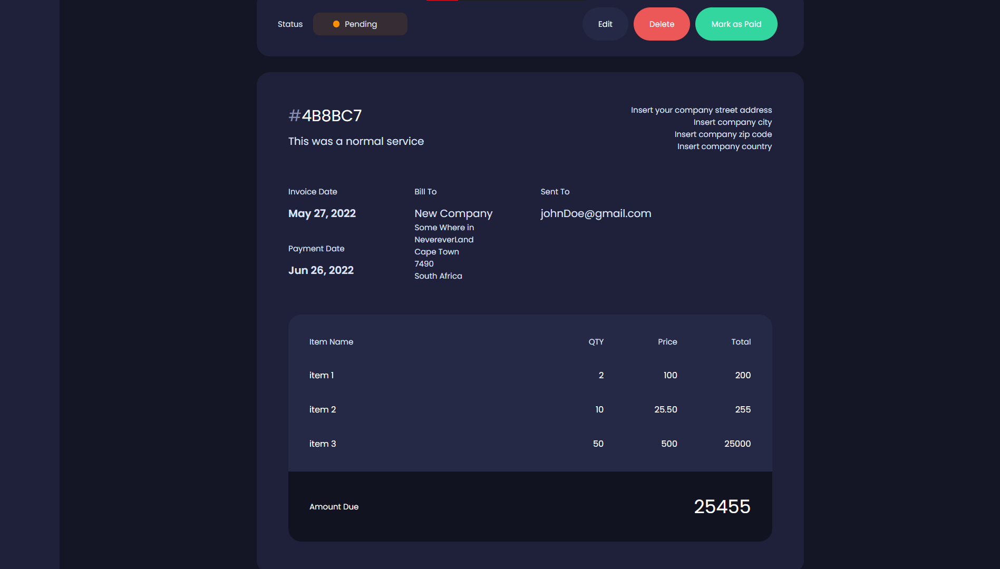
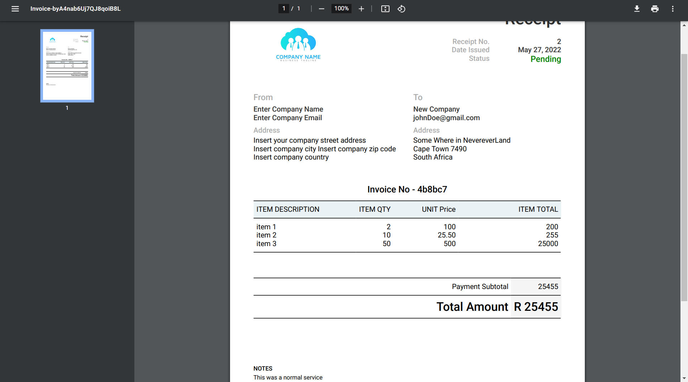

# Vue Invoice

This demo helps ensure that the invoices you send actually reach your customers. Your clients may also appreciate the pdf formate layout.

## Demo

[Live Link](https://invoice-app-d9aa8.web.app)

## Acknowledgements

- [Vue](https://vuejs.org/)
- [Firebase](https://firebase.google.com/)
- [pdfMake](http://pdfmake.org/#/)

## Installation

## Create Folder

**_src/firebase/firebaseInit.js_**

```ruby
import firebase from "firebase/app";
import "firebase/firestore";

var firebaseConfig = {
  apiKey: "Your firebase apiKey",
  authDomain: "Your firebase authDomain",
  projectId: "Your firebase projecjID",
  storageBucket: "Your firebase storageBucket",
  messagingSenderId: "Your firebase messgingSenderId",
  appId: "Your firebase appID",
};

const firebaseApp = firebase.initializeApp(firebaseConfig);

export default firebaseApp.firestore();

```

## Project setup

```

npm install

```

### Compiles and hot-reloads for development

```

npm run serve

```

### Compiles and minifies for production

```

npm run build

```

### Lints and fixes files

```

npm run lint

```

## Features

- PDF Export invoice

## Screenshots

#### Landing



#### Invoice



#### Single Invoice



#### PDF



```

```
